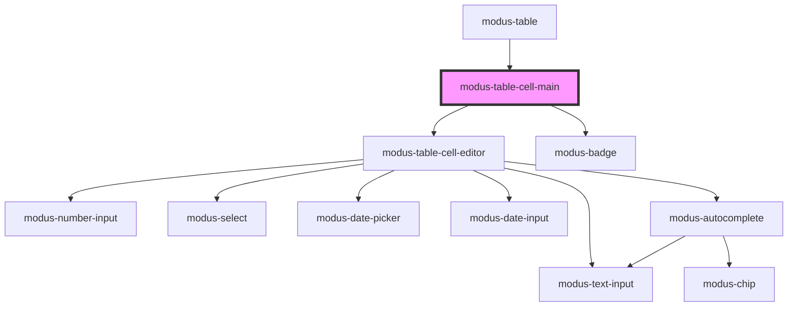

# modus-table-filler-column

<!-- Auto Generated Below -->

## Properties

| Property            | Attribute             | Description | Type                               | Default     |
| ------------------- | --------------------- | ----------- | ---------------------------------- | ----------- |
| `cell`              | --                    |             | `Cell<unknown, unknown>`           | `undefined` |
| `context`           | --                    |             | `TableContext`                     | `undefined` |
| `hasRowsExpandable` | `has-rows-expandable` |             | `boolean`                          | `undefined` |
| `valueChange`       | --                    |             | `(props: TableCellEdited) => void` | `undefined` |

## Dependencies

### Used by

 - [modus-table](../../..)

### Depends on

- [modus-table-cell-editor](../modus-table-cell-editor)
- [modus-badge](../../../../modus-badge)

### Graph

----------------------------------------------

