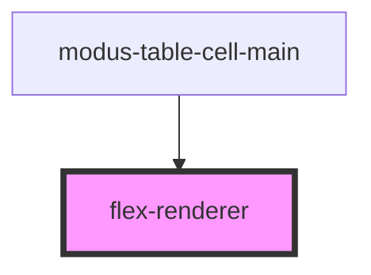

# flex-renderer

<!-- Auto Generated Below -->

## Properties

| Property  | Attribute | Description | Type     | Default |
| --------- | --------- | ----------- | -------- | ------- |
| `content` | `content` |             | `string` | `''`    |

## Dependencies

### Used by

 - [modus-table-cell-main](modus-table-cell-main)

### Graph

----------------------------------------------

