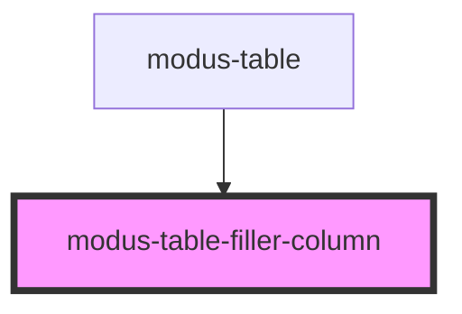

# modus-table-filler-column

<!-- Auto Generated Below -->

## Overview

ModusFillerColumn is to fill empty space within a table or grid when the content in other columns is not wide enough to occupy the entire available width

## Properties

| Property         | Attribute         | Description | Type          | Default     |
| ---------------- | ----------------- | ----------- | ------------- | ----------- |
| `cellBorderless` | `cell-borderless` |             | `boolean`     | `undefined` |
| `container`      | --                |             | `HTMLElement` | `undefined` |
| `summaryRow`     | `summary-row`     |             | `boolean`     | `undefined` |

## Dependencies

### Used by

 - [modus-table](../..)

### Graph

----------------------------------------------

