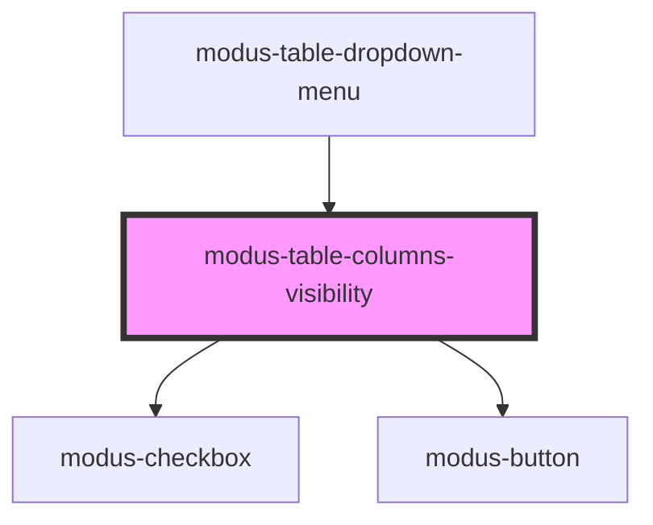

# modus-table-columns-visibility

<!-- Auto Generated Below -->

## Properties

| Property               | Attribute       | Description               | Type                                 | Default     |
| ---------------------- | --------------- | ------------------------- | ------------------------------------ | ----------- |
| `columnsVisibility`    | --              | Column visibility options | `ModusTableColumnsVisibilityOptions` | `undefined` |
| `getAllLeafColumns`    | --              | Table data.               | `() => Column<unknown, unknown>[]`   | `undefined` |
| `maxHeight`            | `max-height`    |                           | `string`                             | `undefined` |
| `menuIconContainerRef` | --              |                           | `HTMLDivElement`                     | `undefined` |
| `showDropdown`         | `show-dropdown` |                           | `boolean`                            | `undefined` |
| `toggleDropdown`       | --              |                           | `(show: boolean) => void`            | `undefined` |

## Dependencies

### Used by

 - [modus-table-dropdown-menu](../modus-table-dropdown-menu)

### Depends on

- [modus-checkbox](../../../../modus-checkbox)
- [modus-button](../../../../modus-button)

### Graph

----------------------------------------------

