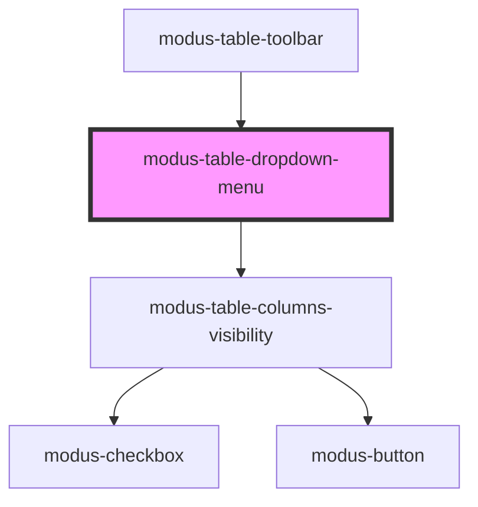

# modus-table-dropdown-menu

<!-- Auto Generated Below -->

## Properties

| Property  | Attribute | Description            | Type                       | Default     |
| --------- | --------- | ---------------------- | -------------------------- | ----------- |
| `options` | --        | dropdown menu options. | `ModusTableToolbarOptions` | `undefined` |
| `table`   | --        | Table data.            | `Table<unknown>`           | `undefined` |

## Dependencies

### Used by

 - [modus-table-toolbar](../modus-table-toolbar)

### Depends on

- [modus-table-columns-visibility](../modus-table-columns-visibility)

### Graph

----------------------------------------------

