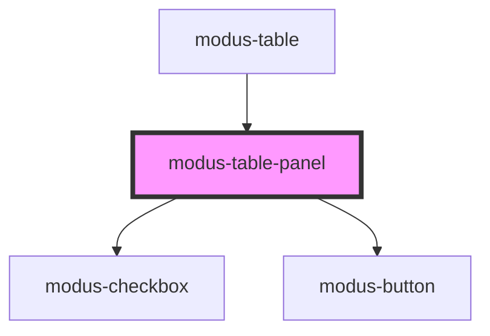

# modus-table-panel

<!-- Auto Generated Below -->

## Properties

| Property       | Attribute | Description                                                                                         | Type                     | Default     |
| -------------- | --------- | --------------------------------------------------------------------------------------------------- | ------------------------ | ----------- |
| `panelOptions` | --        | (Optional) To display a panel options, which allows access to table operations like hiding columns. | `ModusTablePanelOptions` | `undefined` |
| `table`        | --        | Table data.                                                                                         | `Table<unknown>`         | `undefined` |

## Dependencies

### Used by

 - [modus-table](../../..)

### Depends on

- [modus-checkbox](../../../../modus-checkbox)
- [modus-button](../../../../modus-button)

### Graph

----------------------------------------------

