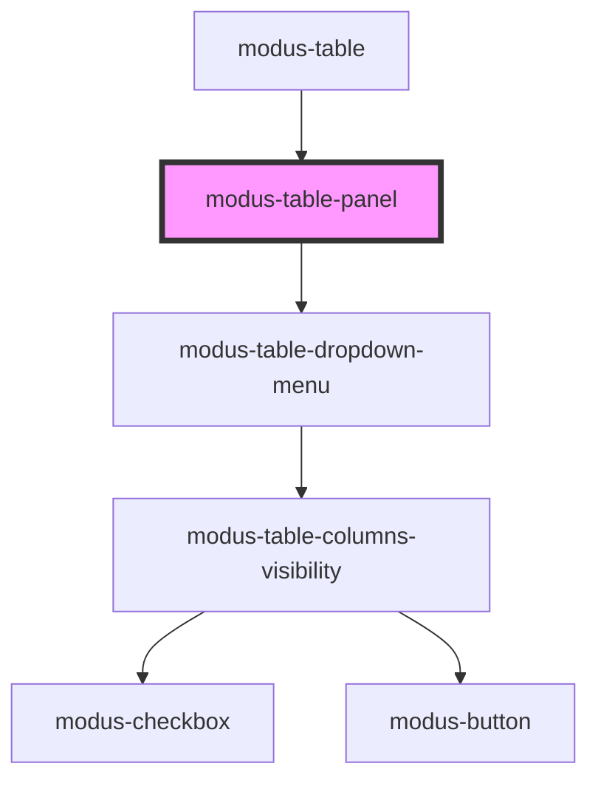

# modus-table-panel

<!-- Auto Generated Below -->

## Properties

| Property  | Attribute | Description                     | Type                     | Default     |
| --------- | --------- | ------------------------------- | ------------------------ | ----------- |
| `options` | --        | (Optional) Table Panel options. | `ModusTablePanelOptions` | `undefined` |
| `table`   | --        | Table data.                     | `Table<unknown>`         | `undefined` |

## Dependencies

### Used by

 - [modus-table](../../..)

### Depends on

- [modus-table-dropdown-menu](../modus-table-dropdown-menu)

### Graph

----------------------------------------------

