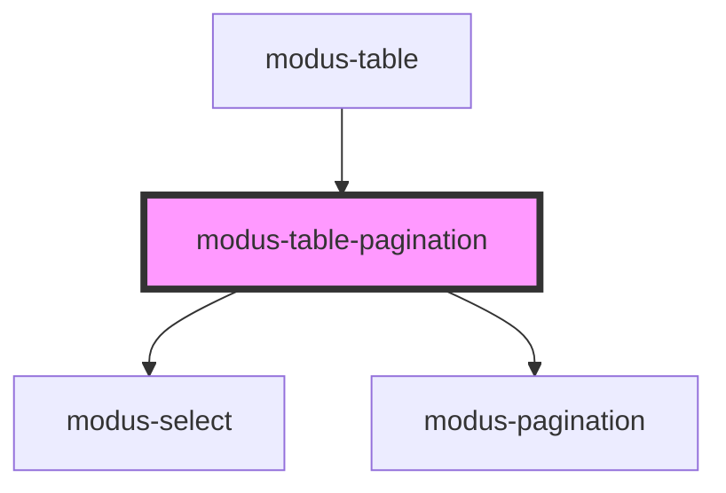

# modus-table-pagination

<!-- Auto Generated Below -->

## Properties

| Property       | Attribute | Description | Type           | Default     |
| -------------- | --------- | ----------- | -------------- | ----------- |
| `tableContext` | --        |             | `TableContext` | `undefined` |

## Dependencies

### Used by

 - [modus-table](..)

### Depends on

- [modus-select](../../modus-select)
- [modus-pagination](../../modus-pagination)

### Graph

----------------------------------------------

