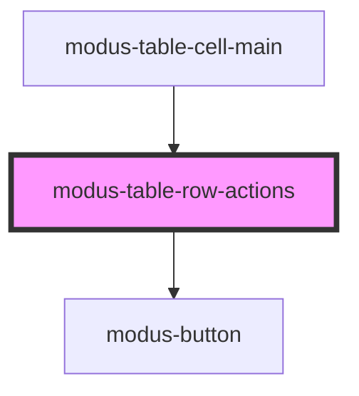

# modus-table-filler-column

<!-- Auto Generated Below -->

## Properties

| Property  | Attribute | Description | Type           | Default     |
| --------- | --------- | ----------- | -------------- | ----------- |
| `context` | --        |             | `TableContext` | `undefined` |
| `row`     | --        |             | `Row<unknown>` | `undefined` |

## Events

| Event                | Description | Type                                    |
| -------------------- | ----------- | --------------------------------------- |
| `overflowRowActions` |             | `CustomEvent<TableRowActionsMenuEvent>` |

## Dependencies

### Used by

 - [modus-table-cell-main](../../../cell/modus-table-cell-main)

### Depends on

- [modus-button](../../../../../modus-button)

### Graph

----------------------------------------------

