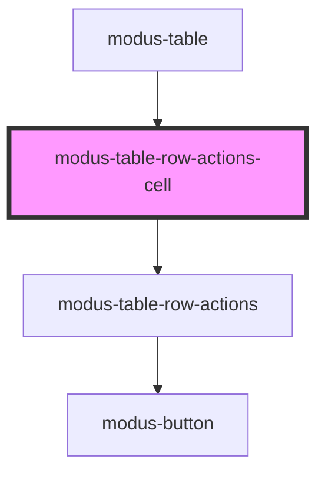

# modus-table-filler-column

<!-- Auto Generated Below -->

## Properties

| Property  | Attribute | Description | Type           | Default     |
| --------- | --------- | ----------- | -------------- | ----------- |
| `context` | --        |             | `TableContext` | `undefined` |
| `row`     | --        |             | `Row<unknown>` | `undefined` |

## Dependencies

### Used by

 - [modus-table](../../../..)

### Depends on

- [modus-table-row-actions](.)

### Graph

----------------------------------------------

