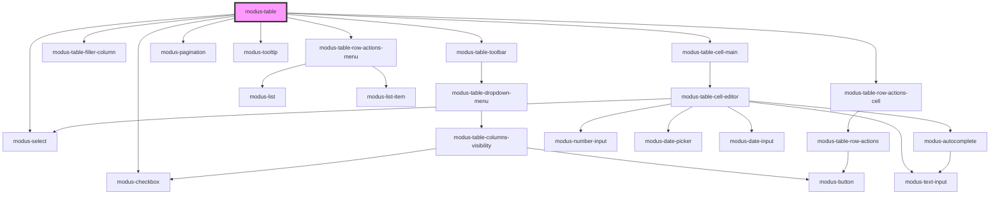

# modus-data-table

<!-- Auto Generated Below -->

## Properties

| Property                  | Attribute                 | Description                                                                                                                         | Type                                   | Default                                                   |
| ------------------------- | ------------------------- | ----------------------------------------------------------------------------------------------------------------------------------- | -------------------------------------- | --------------------------------------------------------- |
| `columnReorder`           | `column-reorder`          | (Optional) To allow column reordering.                                                                                              | `boolean`                              | `false`                                                   |
| `columnResize`            | `column-resize`           |                                                                                                                                     | `boolean`                              | `false`                                                   |
| `columns` _(required)_    | --                        | (Required) To display headers in the table.                                                                                         | `ModusTableColumn<unknown, unknown>[]` | `undefined`                                               |
| `data` _(required)_       | --                        | (Required) To display data in the table.                                                                                            | `unknown[]`                            | `undefined`                                               |
| `displayOptions`          | --                        | (Optional) To control display options of table.                                                                                     | `ModusTableDisplayOptions`             | `{     borderless: false,     cellBorderless: false,   }` |
| `fullWidth`               | `full-width`              |                                                                                                                                     | `boolean`                              | `false`                                                   |
| `hover`                   | `hover`                   | (Optional) To enable row hover in table.                                                                                            | `boolean`                              | `false`                                                   |
| `manualPaginationOptions` | --                        | (Optional) To set modus-table in manual mode.                                                                                       | `ModusTableManualPaginationOptions`    | `undefined`                                               |
| `maxHeight`               | `max-height`              | (Optional) To display a vertical scrollbar when the height is exceeded.                                                             | `string`                               | `undefined`                                               |
| `maxWidth`                | `max-width`               | (Optional) To display a horizontal scrollbar when the width is exceeded.                                                            | `string`                               | `undefined`                                               |
| `pageSizeList`            | --                        |                                                                                                                                     | `number[]`                             | `PAGINATION_DEFAULT_SIZES`                                |
| `pagination`              | `pagination`              |                                                                                                                                     | `boolean`                              | `undefined`                                               |
| `rowActions`              | --                        | (Optional) Actions that can be performed on each row. A maximum of 4 icons will be shown, including overflow menu and expand icons. | `ModusTableRowAction[]`                | `[]`                                                      |
| `rowSelection`            | `row-selection`           | (Optional) To display checkbox.                                                                                                     | `boolean`                              | `false`                                                   |
| `rowSelectionOptions`     | --                        | (Optional) To control multiple row selection.                                                                                       | `ModusTableRowSelectionOptions`        | `{     multiple: false,     subRowSelection: false,   }`  |
| `rowsExpandable`          | `rows-expandable`         | (Optional) To display expanded rows.                                                                                                | `boolean`                              | `false`                                                   |
| `showSortIconOnHover`     | `show-sort-icon-on-hover` | (Optional) To display sort icon on hover.                                                                                           | `boolean`                              | `false`                                                   |
| `sort`                    | `sort`                    | (Optional) To sort data in table.                                                                                                   | `boolean`                              | `false`                                                   |
| `summaryRow`              | `summary-row`             | (Optional) To display summary row.                                                                                                  | `boolean`                              | `false`                                                   |
| `toolbar`                 | `toolbar`                 | (Optional) To display a toolbar for the table.                                                                                      | `boolean`                              | `false`                                                   |
| `toolbarOptions`          | --                        | (Optional) To display a toolbar, which allows access to table operations like hiding columns.                                       | `ModusTableToolbarOptions`             | `null`                                                    |

## Events

| Event                    | Description                                       | Type                                                |
| ------------------------ | ------------------------------------------------- | --------------------------------------------------- |
| `cellLinkClick`          | Emits the link that was clicked                   | `CustomEvent<ModusTableCellLink>`                   |
| `cellValueChange`        | Emits the cell value that was edited              | `CustomEvent<ModusTableCellValueChange>`            |
| `columnOrderChange`      | Emits columns in the updated order                | `CustomEvent<string[]>`                             |
| `columnSizingChange`     | Emits latest column size                          | `CustomEvent<{ [x: string]: number; }>`             |
| `columnVisibilityChange` | Emits visibility state of each column             | `CustomEvent<{ [x: string]: boolean; }>`            |
| `paginationChange`       | Emits selected page index and size                | `CustomEvent<PaginationState>`                      |
| `rowActionClick`         | An event that fires when a row action is clicked. | `CustomEvent<ModusTableRowActionClick>`             |
| `rowExpanded`            | Emits expanded state of the columns               | `CustomEvent<boolean \| { [x: string]: boolean; }>` |
| `rowSelectionChange`     | Emits rows selected                               | `CustomEvent<unknown>`                              |
| `sortChange`             | Emits column sort order                           | `CustomEvent<ColumnSort[]>`                         |

## Methods

### `getColumnData(accessorKey: string) => Promise<unknown[]>`

Returns data of a column.

#### Returns

Type: `Promise<unknown[]>`

: Column data as Array or empty array.

### `toggleColumnVisibility(columnId: string, show: boolean) => Promise<void>`

Toggle the table column visibility

#### Returns

Type: `Promise<void>`

## Slots

| Slot             | Description                                         |
| ---------------- | --------------------------------------------------- |
| `"customFooter"` | Slot for custom footer.                             |
| `"groupLeft"`    | Slot for custom toolbar options added to the left.  |
| `"groupRight"`   | Slot for custom toolbar options added to the right. |

## Dependencies

### Depends on

- [modus-table-toolbar](./parts/panel/modus-table-toolbar)
- [modus-table-filler-column](./parts/fillerColumn)
- [modus-table-row-actions-menu](./parts/row/actions/modus-table-row-actions-menu)
- [modus-select](../modus-select)
- [modus-pagination](../modus-pagination)
- [modus-tooltip](../modus-tooltip)
- [modus-checkbox](../modus-checkbox)
- [modus-table-row-actions-cell](./parts/row/actions)
- [modus-table-cell-main](./parts/cell/modus-table-cell-main)

### Graph

----------------------------------------------

