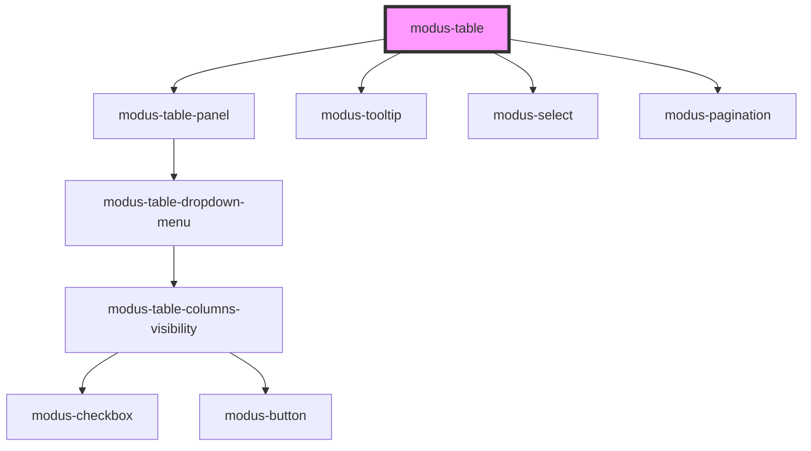

# modus-data-table

<!-- Auto Generated Below -->

## Properties

| Property               | Attribute                 | Description                                                                                         | Type                                   | Default                                                   |
| ---------------------- | ------------------------- | --------------------------------------------------------------------------------------------------- | -------------------------------------- | --------------------------------------------------------- |
| `columnReorder`        | `column-reorder`          | (Optional) To allow column reordering.                                                              | `boolean`                              | `false`                                                   |
| `columnResize`         | `column-resize`           |                                                                                                     | `boolean`                              | `false`                                                   |
| `columns` _(required)_ | --                        | (Required) To display headers in the table.                                                         | `ModusTableColumn<unknown, unknown>[]` | `undefined`                                               |
| `data` _(required)_    | --                        | (Required) To display data in the table.                                                            | `unknown[]`                            | `undefined`                                               |
| `displayOptions`       | --                        | (Optional) To control display options of table.                                                     | `ModusTableDisplayOptions`             | `{     borderless: false,     cellBorderless: false,   }` |
| `fullWidth`            | `full-width`              |                                                                                                     | `boolean`                              | `false`                                                   |
| `hover`                | `hover`                   | (Optional) To enable row hover in table.                                                            | `boolean`                              | `false`                                                   |
| `maxHeight`            | `max-height`              | (Optional) To display a vertical scrollbar when the height is exceeded.                             | `string`                               | `undefined`                                               |
| `maxWidth`             | `max-width`               | (Optional) To display a horizontal scrollbar when the width is exceeded.                            | `string`                               | `undefined`                                               |
| `pageSizeList`         | --                        |                                                                                                     | `number[]`                             | `DefaultPageSizes`                                        |
| `pagination`           | `pagination`              |                                                                                                     | `boolean`                              | `undefined`                                               |
| `panelOptions`         | --                        | (Optional) To display a panel options, which allows access to table operations like hiding columns. | `ModusTablePanelOptions`               | `null`                                                    |
| `rowsExpandable`       | `rows-expandable`         | (Optional) To display expanded rows.                                                                | `boolean`                              | `false`                                                   |
| `showSortIconOnHover`  | `show-sort-icon-on-hover` | (Optional) To display sort icon on hover.                                                           | `boolean`                              | `false`                                                   |
| `showTablePanel`       | `show-table-panel`        | (Optional) To display table panel.                                                                  | `boolean`                              | `false`                                                   |
| `sort`                 | `sort`                    | (Optional) To sort data in table.                                                                   | `boolean`                              | `false`                                                   |
| `summaryRow`           | `summary-row`             | (Optional) To display summary row.                                                                  | `boolean`                              | `false`                                                   |

## Events

| Event           | Description                     | Type                              |
| --------------- | ------------------------------- | --------------------------------- |
| `cellLinkClick` | Emits the link that was clicked | `CustomEvent<ModusTableCellLink>` |
| `sortChange`    | Emits event on sort change      | `CustomEvent<ColumnSort[]>`       |

## Methods

### `getColumnData(accessorKey: string) => Promise<unknown[]>`

Returns data of a column.

#### Returns

Type: `Promise<unknown[]>`

: Column data as Array or empty array.

### `toggleColumnVisibility(columnId: string, show: boolean) => Promise<void>`

Toggle the table column visibility

#### Returns

Type: `Promise<void>`

## Slots

| Slot                | Description                                    |
| ------------------- | ---------------------------------------------- |
| `"customFooter"`    | Slot for custom footer.                        |
| `"panelGroupLeft"`  | Slot for modus data table panel left section.  |
| `"panelGroupRight"` | Slot for modus data table panel right section. |

## Dependencies

### Depends on

- [modus-table-panel](./parts/panel/modus-table-panel)
- [modus-tooltip](../modus-tooltip)
- [modus-select](../modus-select)
- [modus-pagination](../modus-pagination)

### Graph

----------------------------------------------

