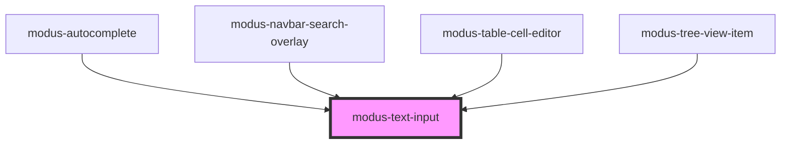

# modus-text-input

<!-- Auto Generated Below -->

## Properties

| Property                    | Attribute                      | Description                                                   | Type                                                                        | Default     |
| --------------------------- | ------------------------------ | ------------------------------------------------------------- | --------------------------------------------------------------------------- | ----------- |
| `ariaLabel`                 | `aria-label`                   | (optional) The input's aria-label.                            | `string`                                                                    | `undefined` |
| `autoFocusInput`            | `auto-focus-input`             | (optional) Sets autofocus on the input.                       | `boolean`                                                                   | `undefined` |
| `clearable`                 | `clearable`                    | (optional) Whether the input has a clear button.              | `boolean`                                                                   | `false`     |
| `disabled`                  | `disabled`                     | (optional) Whether the input is disabled.                     | `boolean`                                                                   | `undefined` |
| `errorText`                 | `error-text`                   | (optional) The input's error state text.                      | `string`                                                                    | `undefined` |
| `helperText`                | `helper-text`                  | (optional) The input's helper text displayed below the input. | `string`                                                                    | `undefined` |
| `includePasswordTextToggle` | `include-password-text-toggle` | (optional) Whether the password text toggle icon is included. | `boolean`                                                                   | `true`      |
| `includeSearchIcon`         | `include-search-icon`          | (optional) Whether the search icon is included.               | `boolean`                                                                   | `undefined` |
| `inputmode`                 | `inputmode`                    | (optional) The input's inputmode.                             | `"decimal" \| "email" \| "numeric" \| "search" \| "tel" \| "text" \| "url"` | `undefined` |
| `label`                     | `label`                        | (optional) The input's label.                                 | `string`                                                                    | `undefined` |
| `maxLength`                 | `max-length`                   | (optional) The input's maximum length.                        | `number`                                                                    | `undefined` |
| `minLength`                 | `min-length`                   | (optional) The input's minimum length.                        | `number`                                                                    | `undefined` |
| `placeholder`               | `placeholder`                  | (optional) The input's placeholder text.                      | `string`                                                                    | `undefined` |
| `readOnly`                  | `read-only`                    | (optional) Whether the input's content is read-only           | `boolean`                                                                   | `undefined` |
| `required`                  | `required`                     | (optional) Whether the input is required.                     | `boolean`                                                                   | `undefined` |
| `size`                      | `size`                         | (optional) The input's size.                                  | `"large" \| "medium"`                                                       | `'medium'`  |
| `textAlign`                 | `text-align`                   | (optional) The input's text alignment.                        | `"left" \| "right"`                                                         | `'left'`    |
| `type`                      | `type`                         | (optional) The input's type.                                  | `"password" \| "text"`                                                      | `'text'`    |
| `validText`                 | `valid-text`                   | (optional) The input's valid state text.                      | `string`                                                                    | `undefined` |
| `value`                     | `value`                        | (optional) The input's value.                                 | `string`                                                                    | `undefined` |

## Events

| Event         | Description                                | Type                  |
| ------------- | ------------------------------------------ | --------------------- |
| `valueChange` | An event that fires on input value change. | `CustomEvent<string>` |

## Methods

### `focusInput() => Promise<void>`

Focus the input.

#### Returns

Type: `Promise<void>`

## Shadow Parts

| Part                | Description |
| ------------------- | ----------- |
| `"input-container"` |             |

## Dependencies

### Used by

 - [modus-autocomplete](../modus-autocomplete)
 - [modus-navbar-search-overlay](../modus-navbar/search-overlay)
 - [modus-table-cell-editor](../modus-table/parts/cell/modus-table-cell-editor)
 - [modus-tree-view-item](../modus-content-tree/modus-tree-view-item)

### Graph

----------------------------------------------

