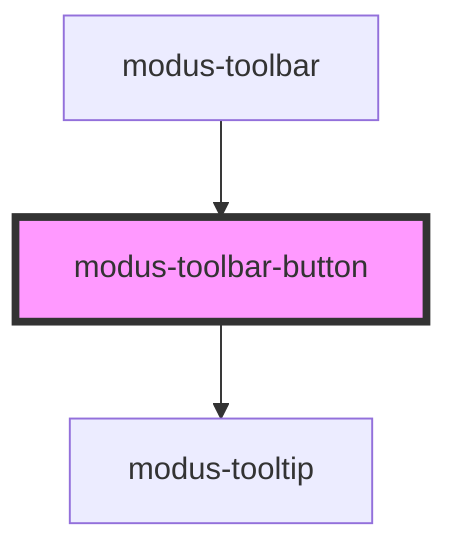

# modus-toolbar-button

<!-- Auto Generated Below -->

## Properties

| Property        | Attribute        | Description                     | Type                         | Default     |
| --------------- | ---------------- | ------------------------------- | ---------------------------- | ----------- |
| `active`        | `active`         |                                 | `boolean`                    | `undefined` |
| `buttonStyle`   | `button-style`   |                                 | `"combined" \| "split"`      | `undefined` |
| `disabled`      | `disabled`       | (optional) Disables the button. | `boolean`                    | `undefined` |
| `divader`       | `divader`        |                                 | `boolean`                    | `undefined` |
| `divaderLayout` | `divader-layout` |                                 | `"horizontal" \| "vertical"` | `undefined` |
| `iconSrc`       | `icon-src`       |                                 | `string`                     | `undefined` |
| `textButton`    | `text-button`    |                                 | `string`                     | `undefined` |
| `tooltip`       | --               |                                 | `ModusToolbarTooltip`        | `undefined` |

## Events

| Event         | Description | Type               |
| ------------- | ----------- | ------------------ |
| `buttonClick` |             | `CustomEvent<any>` |

## Dependencies

### Used by

 - [modus-toolbar](..)

### Depends on

- [modus-tooltip](../../modus-tooltip)

### Graph

----------------------------------------------

