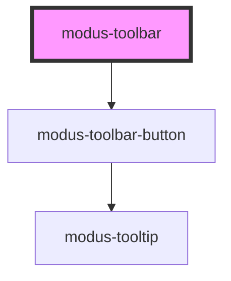

# modus-toolbar

<!-- Auto Generated Below -->

## Properties

| Property       | Attribute       | Description                      | Type                         | Default        |
| -------------- | --------------- | -------------------------------- | ---------------------------- | -------------- |
| `buttons`      | --              | The buttons to render.           | `ModusToolbarButton[]`       | `undefined`    |
| `layout`       | `layout`        | (optional) The toolbar's layout. | `"horizontal" \| "vertical"` | `'horizontal'` |
| `toolbarStyle` | `toolbar-style` | (optional) The toolbar's style   | `"combined" \| "split"`      | `'combined'`   |

## Dependencies

### Depends on

- [modus-toolbar-button](button)

### Graph

----------------------------------------------

