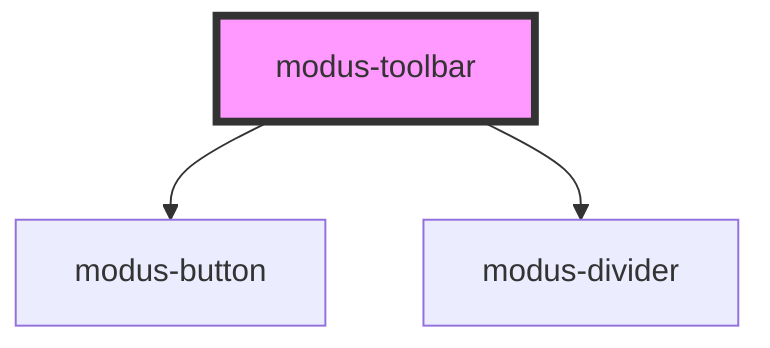

# modus-floating-toolbar

<!-- Auto Generated Below -->

## Properties

| Property    | Attribute    | Description                         | Type      | Default     |
| ----------- | ------------ | ----------------------------------- | --------- | ----------- |
| `ariaLabel` | `aria-label` | (optional) The button's aria-label. | `string`  | `undefined` |
| `disabled`  | `disabled`   | (optional) Disables the button.     | `boolean` | `undefined` |

## Dependencies

### Depends on

- [modus-button](../modus-button)
- [modus-divider](.)

### Graph

----------------------------------------------

