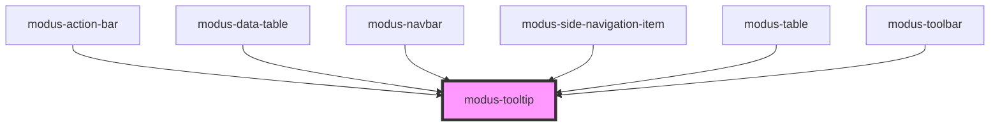

# modus-tooltip

<!-- Auto Generated Below -->

## Properties

| Property    | Attribute    | Description                                                | Type                                               | Default     |
| ----------- | ------------ | ---------------------------------------------------------- | -------------------------------------------------- | ----------- |
| `ariaLabel` | `aria-label` | (optional) The tooltip's aria-label.                       | `string`                                           | `undefined` |
| `disabled`  | `disabled`   | Hide the tooltip                                           | `boolean`                                          | `undefined` |
| `position`  | `position`   | (optional) The tooltip's position relative to its content. | `"auto" \| "bottom" \| "left" \| "right" \| "top"` | `'top'`     |
| `text`      | `text`       | The tooltip's text.                                        | `string`                                           | `undefined` |

## Dependencies

### Used by

 - [modus-action-bar](../modus-action-bar)
 - [modus-data-table](../modus-data-table)
 - [modus-navbar](../modus-navbar)
 - [modus-side-navigation-item](../modus-side-navigation/modus-side-navigation-item)
 - [modus-table](../modus-table)
 - [modus-toolbar](../modus-toolbar)

### Graph

----------------------------------------------

